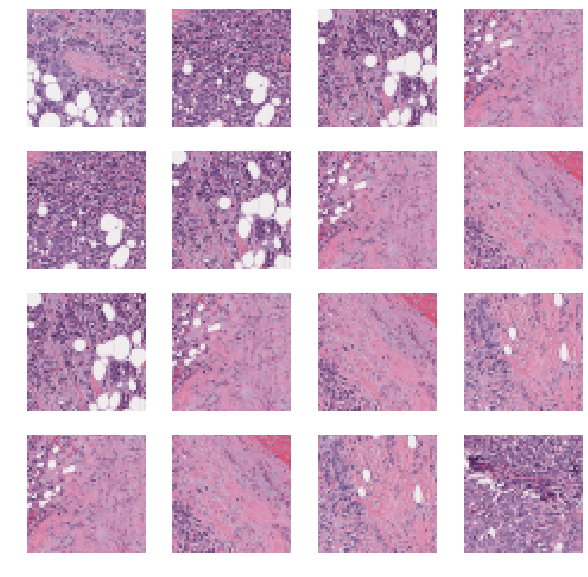
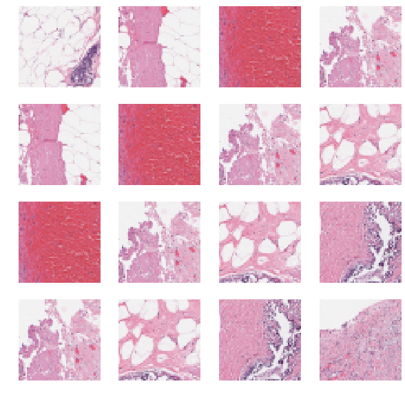
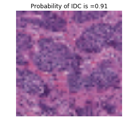
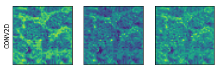

# Examples of applying deep lerarning to medical imaging diagnosis 


In this repository, we provide simple examples of how Convolutional Neural Networks can be used 
to detect medical conditions in the medical imaging data. 
We are going to add more examples to this placeholder in the future. 
The datasets used so far are the followings:

## Malaria 

The dataset contains images of parasatized and uninfected cells. The data were released along with this publication: 
[Pre-trained convolutional neural networks as feature extractors toward improved Malaria parasite detection in thin blood smear images.](https://peerj.com/articles/4568/) by Rajaraman etal 2018. The authors mainly took advantage of deep pretrained models to extract features from the images in this dataset. Then they add fully connected layer on top of the pretrained models to perform classification.
In our work, we don't use any pretained model. Instead, we train a vanilla CNN model from scratch and we obtain reasonable results.

## HAM data set for detection of skin lesion cancers

The dataset is taken from [ISIC 2018 Challenge: Skin Lesion Analysis Towards Melanoma Detection](https://challenge2018.isic-archive.com/).
It consists of a large collection of images of common skin lesions. For a full description refer to [Tschandl etal 2018](https://doi.org/10.7910/DVN/DBW86T). In particular, we work with the 3rd task of the challenge: Disease classification. The full description of the challenge can be found here [Codella etal 2019](https://arxiv.org/abs/1902.03368). Before running the inference and evaluation code ```train_eval.py```, run ```buid_datadir.py```. This will organize the directory such that the data can be accessed through Keras's ImageDataGenerator. 

## Breast Histopathology Images

This data set is hosted on [Kaggle Breast Histopathology Images](https://www.kaggle.com/paultimothymooney/breast-histopathology-images), but the 
original files are located in [this website]( http://gleason.case.edu/webdata/jpi-dl-tutorial/IDC_regular_ps50_idx5.zip). 
For a more thorough description of the data and modeling of the data with Convolutional Neural Nets please refer to 
[Janowczyk & Madabhushi 2016](https://www.ncbi.nlm.nih.gov/pubmed/27563488) and [Cruz-Roa etal 2014](https://www.ncbi.nlm.nih.gov/pubmed/27563488). 
The data consists of image patches with 198738 negative example and 78786 positive examples.

#### Visual inspection of the tissue images with positive and negative IDC test
positive examples: 



negative examples:



We note that one of the features that sets the cancereous and the healthy tissues apart is the presence 
of clumps with a purple color in the positive examples.

#### model perforemance

The performance of the model is summarized in the following table:

              precision    recall  f1-score   support

      no IDC       0.95      0.92      0.93     19874
         IDC       0.81      0.87      0.84      7879
    accuracy                           0.91     27753
    macro avg      0.88      0.90      0.89     27753
    weighted avg   0.91      0.91      0.91     27753
    
The reported true positive rate for both cancerous and healthy tissue images are around 90 percent. 
While the precision (1 - false positive rate) for the healthy tissue images is low, we note that the false positive rate 
for the cancerous tissues is around 20 percents which means that around 20% of the tissue images identified as cancereous 
are in fact healthy. We believe that this can be improved by a more careful threshold and hyper-parameter tuning.
Note that we have introduced weights to account for the imbalanced representation of classes in the training data.
    
#### Feature maps in the convolutional layers

Let's take a look at an example of a tissue with cancerous cells correcly predicted by our model as a positive case with 
91 percent probability:



This is what the first convolutional layer picks up:


